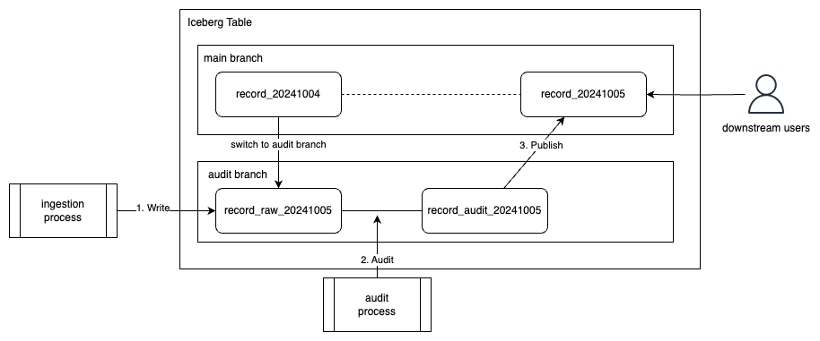

# Write-Audit-Publish (WAP) Pattern implemented in Pyspark (AWS Glue ETL)

This repository shows how to implement the Write-Audit-Publish (WAP) pattern using:
- Apache Spark
- Apache Iceberg

It's aimed at Data Engineers who want to get started quickly

> [!WARNING]
> This repository is for demonstratin purposes only:
> - It's barebones by design, to not distract from the WAP pattern.
> - I've included rather long, explainatory comments about things to do differently in a real life scenario.
> - It's meant to get you started quickly and to explain things, not to be production code.

> [!TIP] 
> Check out my other repository, in case you're interested in [a professional setup for Glue and Pyspark development](https://github.com/dmschauer/glue-pyspark-local).

# How to use this?

In your AWS account:
- Create an S3 bucket
- Create IAM role with matching permissions for Glue and S3 access
- Create a Glue 5.0 ETL job
  - Copy paste the code in `wap_etl.py` into the job
  - In `main()` replace the value of `s3_bucket` with your own
  - Run it
- (optional) Check results in Athena

> [!IMPORTANT]
> Using Glue 5.0 is important. The Iceberg branching feature was introduced in Iceberg version 1.2.0. Out of the box Glue 4.0 only supports Iceberg version 1.0.0 though, but Glue 5.0 supports Iceberg 1.6.1. [Details in the AWS Glue Documentation](https://docs.aws.amazon.com/glue/latest/dg/aws-glue-programming-etl-format-iceberg.html).
> 
> You can also make Glue 4.0 work but it requires significant setup effort by bringing your own Iceberg JAR files, instructions can be found [in the AWS Iceberg Precriptive Guidance](https://docs.aws.amazon.com/prescriptive-guidance/latest/apache-iceberg-on-aws/iceberg-glue.html). The Iceberg JARs can be found [on the official Iceberg website](https://iceberg.apache.org/releases/#downloads).

> [!TIP] 
> Most of the code can also be used without AWS access. It's mostly pure Pyspark code.

# Appendix A: What is Write-Audit-Publish?

Write-Audit-Publish (WAP) is a popular pattern in Data Engineering. Its purpose is to avoid publishing bad data.

The idea is to run data quality checks on data _after computation, but before it is published_ to consumers.

The WAP pattern involves three key stages:
1. Write: Data is written to an audit branch
2. Audit: Quality checks are performed on the audit branch
3. Publish: Validated data is merged into the main branch (or not, in case the checks failed)

Image source: https://aws.amazon.com/blogs/big-data/build-write-audit-publish-pattern-with-apache-iceberg-branching-and-aws-glue-data-quality/

A common mistake is to do data quality checks only retroactively, after bad data was already made available to consumers.

In general, this should be avoided because the bad data could already be accessed by consumers (and then propagated to their own consumers etc.) while you're still fixing the mistakes.

It's much cheaper to avoid this situation then to fix things after the damage was already done

An even worse mistake would be to not run data quality checks at all, leaving your consumers to discover errors by chance, maybe only after malinfored decisions were made.

What you gain by using WAP:
- Saving _lots_ of time and money by avoiding mistakes that are costly to fix
- Running ETL pipelines with confidence
- Establish trust in your work, and avoiding to erode it

Costs of using WAP:
- Additional complexity (only a little though)
- General engineering cost of implementing data quality checks
- (Cloud) cost for additional processing power required
- Pipeline runs longer, making it harder to meet SLAs

In general the pros far outweigh the downsides. The more important the data the clearer it becomes.

# Appendix B: What if they just want the data?

Sometimes consumers want you to publish data that isn't quality checked. 

Unchecked data runs the risk of being faulty. As a Data Engineer you should __strongly__ discourage this practice. 

If your word of caution doesn't suffice, make it an explicit, written agreement with each consumer. In the agreement, highlight that consumers were warned about:
- the risk of causing malinformed business decisions
- the risk of propagating faulty data, which might become an organization-wide effort to fix

You shouldn't be the one to blame in case they specically requested this risky practice you advised them not to do.

Keep it simple though. A simple email you send them and they reply by acknowleding the risks could be enough for that. 

# References used

- https://aws.amazon.com/blogs/big-data/build-write-audit-publish-pattern-with-apache-iceberg-branching-and-aws-glue-data-quality/ 
- https://docs.aws.amazon.com/glue/latest/dg/aws-glue-programming-etl-format-iceberg.html
- https://docs.aws.amazon.com/prescriptive-guidance/latest/apache-iceberg-on-aws/iceberg-glue.html
- https://iceberg.apache.org/releases/
- https://iceberg.apache.org/docs/latest/branching/
- https://www.guptaakashdeep.com/wap-via-apache-iceberg-on-aws/